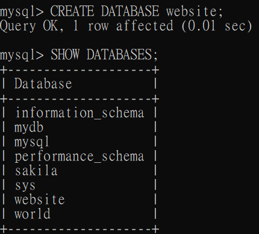
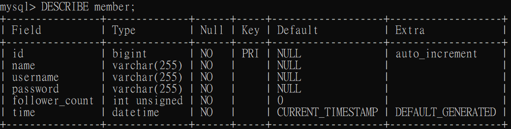

## Task 2: Create database and table in your MySQL server

### Create a new database named website
```mysql
mysql>CREATE DATABASE website;
```


### Create a new table named_ _member__, in the_ _website_ _database, designed as below
```mysql
mysql> USE website;
Database changed
mysql> CREATE TABLE member (
    ->   id BIGINT AUTO_INCREMENT PRIMARY KEY,
    ->   name VARCHAR(255) NOT NULL,
    ->   username VARCHAR(255) NOT NULL,
    ->   password VARCHAR(255) NOT NULL,
    ->   follower_count INT UNSIGNED NOT NULL DEFAULT 0,
    ->   time DATETIME NOT NULL DEFAULT CURRENT_TIMESTAMP
    -> );
```
