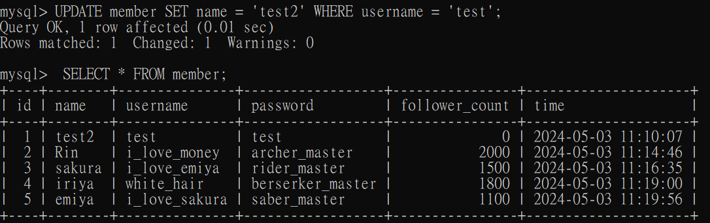

## Task 2: Create database and table in your MySQL server

### Create a new database named website

```mysql
mysql>CREATE DATABASE website;
```


### Create a new table named member, in the website database, designed as below

```mysql
mysql> USE website;
Database changed
mysql> CREATE TABLE member (
    ->   id BIGINT AUTO_INCREMENT PRIMARY KEY,
    ->   name VARCHAR(255) NOT NULL,
    ->   username VARCHAR(255) NOT NULL,
    ->   password VARCHAR(255) NOT NULL,
    ->   follower_count INT UNSIGNED NOT NULL DEFAULT 0,
    ->   time DATETIME NOT NULL DEFAULT CURRENT_TIMESTAMP
    -> );
```


## Task 3: SQL CRUD

### INSERT a new row to the member table where name, username and password must be set to test. INSERT additional 4 rows with arbitrary data.

```mysql
mysql> INSERT INTO member (name, username, password) VALUES ('test', 'test', 'test');

mysql> INSERT INTO member (name, username, password, follower_count)
    -> VALUES ('Rin','i_love_money','archer_master',2000);
Query OK, 1 row affected (0.00 sec)

mysql> INSERT INTO member (name, username, password, follower_count)
    ->  VALUES ('sakura', 'i_love_emiya', 'rider_master',1500)
    -> ;
Query OK, 1 row affected (0.00 sec)

mysql> INSERT INTO member (name, username, password, follower_count)
    -> VALUES ('iriya', 'white_hair', 'berserker_master',1800);
Query OK, 1 row affected (0.00 sec)

mysql> INSERT INTO member (name, username, password, follower_count)
    -> VALUES ('emiya', 'i_love_sakura', 'saber_master',1100);
Query OK, 1 row affected (0.00 sec)
```
### SELECT all rows from the member table.

```mysql
mysql> SELECT * FROM member;
```


### SELECT all rows from the member table, in descending order of time.

```mysql
mysql> SELECT * FROM member ORDER BY time DESC;
```


### SELECT total 3 rows, second to fourth, from the member table, in descending order of time.

```mysql
mysql> SELECT * FROM member ORDER BY time DESC LIMIT 3 OFFSET 1;
```


### SELECT rows where username equals to test.

```mysql
mysql> SELECT * FROM member WHERE username = 'test';
```


### SELECT rows where name includes the es keyword.

```mysql
mysql> SELECT * FROM member WHERE name LIKE '%es%';
```


### SELECT rows where both username and password equal to test.

```mysql
mysql> SELECT * FROM member WHERE username = 'test' AND password = 'test';
```


### UPDATE data in name column to test2 where username equals to test.

```mysql
mysql> UPDATE member SET name = 'test2' WHERE username = 'test';
```


## Task 4: SQL Aggregation Functions

### SELECT how many rows from the member table.

```mysql
mysql> SELECT COUNT(*) FROM member;
```

### SELECT the sum of follower_count of all the rows from the member table.

```mysql
mysql> SELECT SUM(follower_count) AS total_followers FROM member;
```
### SELECT the average of follower_count of all the rows from the member table.

```mysql
mysql> SELECT AVG(follower_count) AS average_followers FROM member;
```

### SELECT the average of follower_count of the first 2 rows, in descending order of follower_count, from the member table.

```mysql
mysql> SELECT AVG(follower_count) AS average_top_two
    -> FROM (
    -> SELECT follower_count
    -> FROM member
    -> ORDER BY follower_count DESC
    -> LIMIT 2
    -> ) AS top_two;
```


## Task 5: SQL JOIN

### Create a new table named message, in the website database. designed as below
```mysql
mysql> CREATE TABLE messenge(
    -> id bigint PRIMARY KEY AUTO_INCREMENT,
    -> member_id bigint not null,
    -> content varchar(255) not null,
    -> like_count int unsigned not null default 0,
    -> time datetime not null DEFAULT CURRENT_TIMESTAMP,
    -> FOREIGN KEY(member_id) REFERENCES member(id)
    ->);
```


#### 新增一筆資料
```mysql
mysql> INSERT INTO message ( member_id, content, like_count)VALUES(3,'good job',18);
```

### SELECT all messages, including sender names. We have to JOIN the member table to get that.

```mysql
mysql> SELECT message.*,member.name AS sender_name FROM message JOIN member ON 
    -> message.member_id=member.id;
```


#### 再新增一筆資料
```mysql
mysql> INSERT INTO message ( member_id, content, like_count)VALUES(1, "Nice test", 666);
```

### SELECT all messages, including sender names, where sender username equals to test. We have to JOIN the member table to filter and get that.

```mysql
mysql> SELECT message.*, member.name AS sender_name
    -> FROM message
    -> JOIN member ON message.member_id = member.id
    -> WHERE member.username = 'test';
```


### Use SELECT, SQL Aggregation Functions with JOIN statement, get the average like count of messages where sender username equals to test.

```mysql
mysql> SELECT AVG(message.like_count) AS avg_like_count 
    -> FROM message JOIN member 
    -> ON message.member_id = member.id WHERE member.username = 'test';
```


### Use SELECT, SQL Aggregation Functions with JOIN statement, get the average like count of messages GROUP BY sender username.

```mysql
mysql> SELECT member.username, AVG(message.like_count) AS avg_like_count 
    -> FROM message JOIN member 
    -> ON message.member_id = member.id 
    -> GROUP BY member.username;
```

